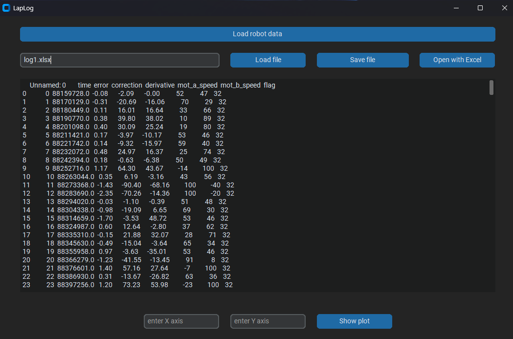

# LapLog

Telemetry tool for my line [Linefollower](https://github.com/Vaseksch/linefollower_esp32s3_Rev_C) project. Load, visualize and save robot run data.

## Features
- Load data from robot via serial connection
- Load and save data from CSV files
- Plot any combination of telemetry columns
- Read, write and open `.xlsx` files directly within the application, or launch them instantly in Excel
- Calculate PID gains (Kp, Kd) from recorded run data using the Ziegler-Nichols method

